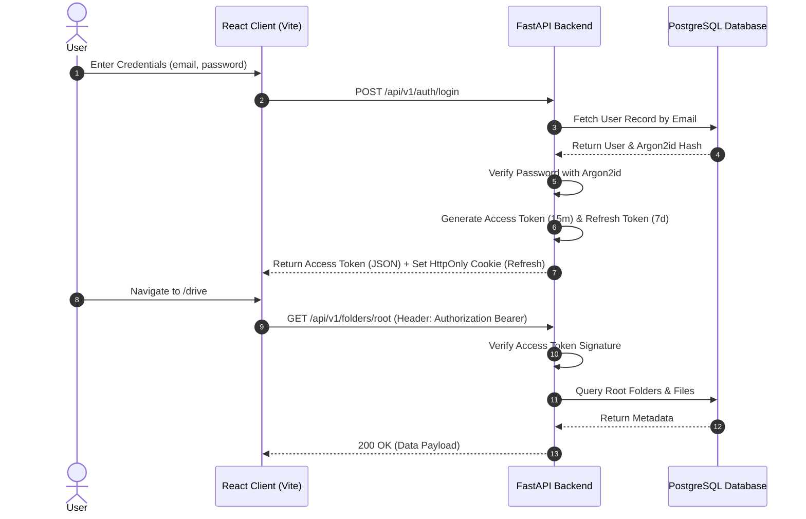
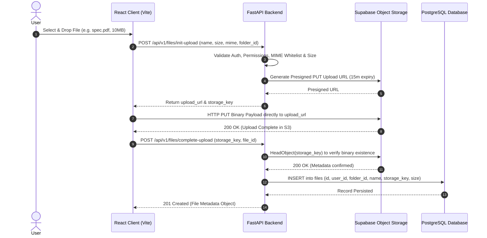
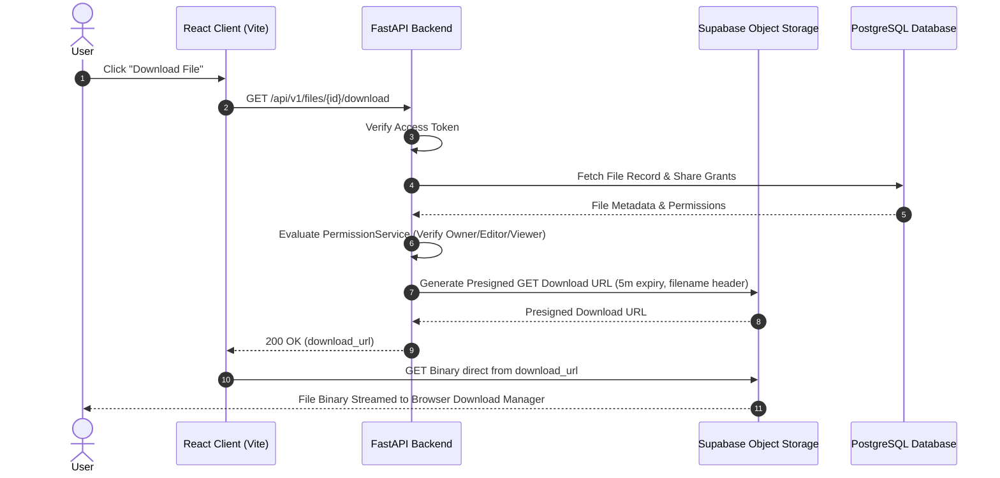
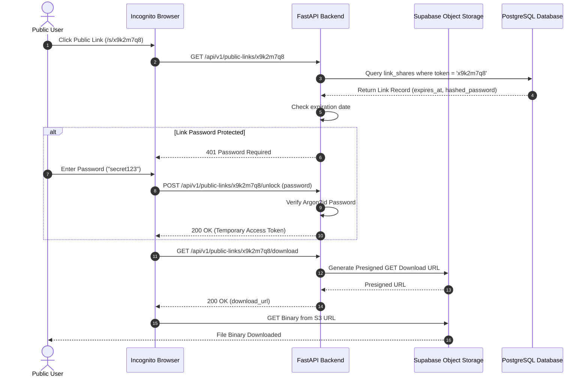

# SecStorage — System Data Flow & Sequence Diagrams

**Document Version:** 1.0.0  
**Target Sequence Prompt:** Prompt 03 Deliverable  
**Author:** SecStorage Technical Architecture Controller  

---

## 1. Authentication & Session Rotation Flow



---

## 2. Direct-to-Storage Presigned File Upload Flow



---

## 3. Presigned File Download Flow



---

## 4. Public Shareable Link Access & Download Flow



---

## 5. File & Folder Lifecycle Flow

```text
    [New Upload Request]
            │
            ▼
   [Upload Initialized] ──(S3 Binary Upload)──► [Complete Upload]
                                                        │
                                                        ▼
                                                  [ACTIVE STATE]
                                                        │
                   ┌────────────────────────────────────┼────────────────────────────────────┐
                   │                                    │                                    │
                   ▼                                    ▼                                    ▼
           [Renamed / Moved]                    [Starred / Unstarred]                   [Shared w/ User]
                   │                                    │                                    │
                   └────────────────────────────────────┼────────────────────────────────────┘
                                                        │
                                                        ▼
                                             [Soft Delete to Trash]
                                              (deleted_at = now())
                                                        │
                                      ┌─────────────────┴─────────────────┐
                                      │                                   │
                                      ▼                                   ▼
                              [Restore to Drive]                 [Permanent Purge]
                            (deleted_at = NULL)             (Delete DB Record & S3 Key)
                                      │                                   │
                                      ▼                                   ▼
                               [ACTIVE STATE]                      [DESTROYED]
```
