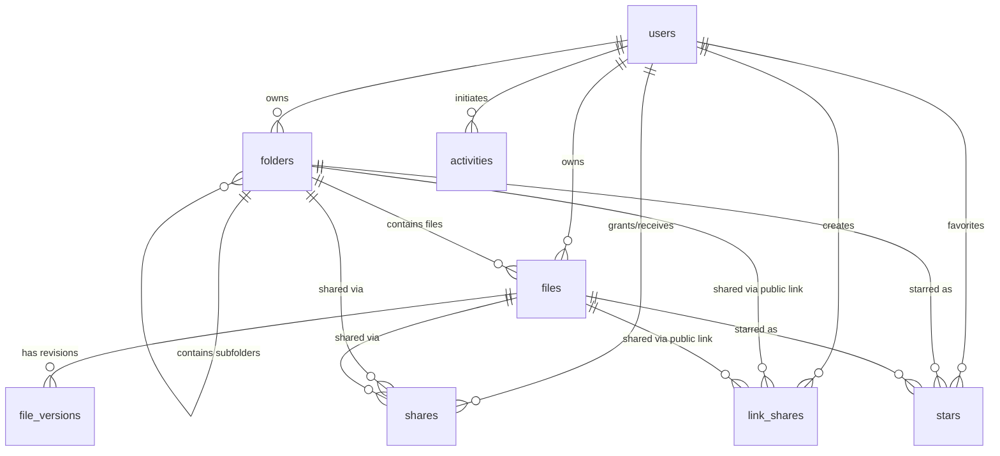

# SecStorage Entity Relationship Architecture

This document describes the primary entity relationships and referential integrity constraints across the SecStorage PostgreSQL database schema.

## Entity Relationship Map

## Foreign Key Deletion Strategies

| Parent Table | Child Table | Foreign Key Column | On Delete Action | Rationale |
| :--- | :--- | :--- | :--- | :--- |
| `users` | `folders` | `folders.user_id` | `CASCADE` | User deletion cascades to owned folder hierarchy |
| `users` | `files` | `files.user_id` | `CASCADE` | User deletion cascades to owned files |
| `folders` | `folders` | `folders.parent_id` | `RESTRICT` | Prevents orphan subfolders if parent folder is dropped without cleanup |
| `folders` | `files` | `files.folder_id` | `RESTRICT` | Prevents orphan files if parent directory is deleted |
| `files` | `file_versions` | `file_versions.file_id` | `CASCADE` | File versions belong exclusively to logical file |
| `users` | `file_versions` | `file_versions.created_by` | `SET NULL` | Preserves historical version record even if uploader account is purged |
| `users` | `shares` | `shares.grantor_id` | `CASCADE` | Purges granted shares on user deletion |
| `users` | `shares` | `shares.grantee_id` | `CASCADE` | Purges received shares on recipient deletion |
| `folders` | `shares` | `shares.folder_id` | `CASCADE` | Deleting shared folder cleans up share permissions |
| `files` | `shares` | `shares.file_id` | `CASCADE` | Deleting shared file cleans up share permissions |
| `folders` | `link_shares` | `link_shares.folder_id` | `CASCADE` | Deleting folder revokes public link |
| `files` | `link_shares` | `link_shares.file_id` | `CASCADE` | Deleting file revokes public link |
